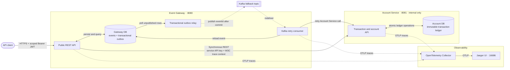

# Event Ledger

A Java 25/Spring Boot 4 implementation of two independently runnable services that accept financial
transaction events, tolerate duplicate and out-of-order delivery, and remain observable and responsive
when a downstream service fails.

## Architecture



The **Event Gateway** validates and stores public events, enforces idempotency, exposes event queries,
and calls the Account Service. The **Account Service** owns account transactions, balances, and recent
transaction history. The services have separate databases and share no runtime state.

### Security boundary

The Gateway is an OAuth2 resource server. Local demos use HS256 JWTs; production can set
`GATEWAY_JWT_JWK_SET_URI` to validate asymmetric tokens from an OAuth2/OIDC provider. It verifies the
signature, expiration, issuer, and audience, then applies least-privilege scopes:

| Route | Required scope |
|---|---|
| `POST /events` | `events.write` |
| `GET /events...` | `events.read` |
| `GET /accounts...` | `accounts.read` |
| `/actuator/**` | `ops` |

The required assessment endpoint `GET /health` remains anonymous and returns only basic diagnostics.
All other Gateway routes require authentication. The internal Account Service requires a separate
`X-Service-Api-Key` on every route, including health and actuator endpoints. The Gateway adds this
credential automatically; clients never receive it. API requests are limited per authenticated JWT
subject and Gateway instance (120 requests/minute by default) and return `429` plus `Retry-After`
when exhausted.

The committed specifications are in [`openapi/event-gateway.yaml`](openapi/event-gateway.yaml) and
[`openapi/account-service.yaml`](openapi/account-service.yaml).

## Key decisions

### Duplicate delivery

Both services enforce a database-unique `eventId` and compare a canonical SHA-256 fingerprint of the
business payload. An identical duplicate returns the original event (`200 OK`) and cannot alter the
balance twice. Reusing an ID with different data returns `409 Conflict`. Defense-in-depth idempotency
at the Account Service makes a Gateway retry safe if the Account Service commits but its HTTP response
is lost.

### Out-of-order delivery

`eventTimestamp` is stored separately from arrival/application time. Gateway listings use
`eventTimestamp ASC, eventId ASC`, giving deterministic chronological results. Account balances are
computed from the authoritative immutable transaction ledger in one signed aggregate statement as
`SUM(CREDIT) - SUM(DEBIT)`. The single statement observes one database snapshot, and addition is
commutative, so neither arrival order nor concurrent posting can change the result. `eventTimestamp`
is the business-effective time; `appliedAt` is the server-controlled posting time. Money uses
`BigDecimal` with at most 15 integer and four fractional digits, never floating-point arithmetic.

The financial invariants and scaling path are documented in
[`docs/financial-ledger-invariants.md`](docs/financial-ledger-invariants.md).

An account is single-currency: its first transaction establishes the currency and a later mismatch is
rejected with `409 Conflict`. This prevents invalid cross-currency arithmetic.

### Resiliency

The Gateway's Account Service client uses:

- 500 ms connect and 1 second response timeouts;
- at most three attempts with capped exponential backoff and random jitter;
- a Resilience4j circuit breaker that opens after repeated transient failures;
- no retries for downstream `4xx` responses.

The retry begins at 200 ms, doubles on each attempt, randomizes each delay by up to 50%, and caps the
delay at two seconds. These values are externally configurable. Synchronous REST remains the primary
path. If all bounded REST attempts fail, the Gateway atomically marks the event `QUEUED` and inserts an
outbox message in the same local database transaction, then returns `202 Accepted`. A background relay
locks unpublished rows in bounded batches, publishes only the `eventId`, and marks each row published
only after an `acks=all` broker acknowledgment. If Kafka is unavailable, the committed outbox row stays
pending and is retried without losing the accepted event. Published rows are retained for seven days by
default for diagnosis and then cleaned up.

The Kafka consumer reloads the authoritative payload from the Gateway database and retries until the
Account Service recovers. A successful retry changes the event to `APPLIED`; a permanent downstream
`4xx` changes it to `FAILED` and is not retried. A relay crash after broker acknowledgment but before the
outbox status commit can publish a record more than once. Producer idempotence reduces broker-level
duplicates, while the Account Service's unique `eventId` constraint remains the final exactly-once-effect
guard. When Kafka fallback is explicitly disabled, an Account Service outage records `FAILED` and returns
the original structured `503`. Gateway-local reads continue to work throughout an outage.

## Prerequisites

- Java 25 for manual execution
- Docker with Docker Compose for the simplest startup and full integration tests

Maven does not need to be installed; the Maven Wrapper is included.

## Start with Docker Compose

```shell
docker compose up --build
```

Compose starts the Gateway, Account Service, a single-node KRaft Kafka broker, an OpenTelemetry
Collector, and Jaeger. The public Gateway is available at `http://localhost:8080`; the Account
Service, Kafka, and Collector are reachable only on the Compose network. Jaeger's trace search UI is
available at `http://localhost:16686`.

The Compose broker uses plaintext on its private development network. A production deployment should
use a managed or multi-broker Kafka cluster with TLS/SASL authentication, topic ACLs, replication, and
environment-specific retention policies.

The checked-in credential defaults are strictly for local demonstration. For any shared environment,
copy `.env.example` to `.env`, replace both secrets, and mint JWTs using the same Base64 JWT secret.

Stop the system with:

```shell
docker compose down
```

Add `-v` only when you intentionally want to remove both persisted H2 volumes and the Kafka volume.

## Start manually

In terminal one:

```shell
./mvnw -pl account-service spring-boot:run
```

In terminal two:

```shell
./mvnw -pl event-gateway spring-boot:run
```

Manual mode expects Kafka at `localhost:9092`. To run only the required synchronous REST baseline
without Kafka, set `KAFKA_FALLBACK_ENABLED=false` before starting the Gateway; Account Service outages
then return `503` as before.

On Windows PowerShell, use `./mvnw.cmd` instead of `./mvnw`.

Manual mode stores separate H2 files below each process's `data` directory. Configuration can be
overridden with `ACCOUNT_DB_URL`, `GATEWAY_DB_URL`, and `ACCOUNT_SERVICE_URL`.

## Authentication and HTTPS

Generate a one-hour local development token in PowerShell:

```powershell
$token = powershell -ExecutionPolicy Bypass -File ./scripts/New-DevToken.ps1
```

The script grants the demo client all API and operations scopes. Parameters can restrict scopes or
change the subject, issuer, audience, lifetime, and secret. It is a development convenience, not an
identity provider; production should supply JWTs from the organization's OAuth2 authorization server
and configure its JWK Set URI.

HTTPS is configurable directly on the Gateway. To run the local containers with a generated,
self-signed development certificate:

```powershell
powershell -ExecutionPolicy Bypass -File ./scripts/New-DevCertificate.ps1
docker compose -f docker-compose.yml -f docker-compose.tls.yml up --build
```

The Gateway then uses `https://localhost:8080`. Browsers and curl will warn because the development
certificate is self-signed. In production, terminate TLS at the ingress/load balancer or mount a
managed PKCS#12 keystore and set the `GATEWAY_SSL_*` variables. Never commit a real certificate,
private key, service API key, or JWT signing secret.

## Try the API

Submit an event:

```powershell
curl.exe -i -X POST http://localhost:8080/events `
  -H "Authorization: Bearer $token" `
  -H "Content-Type: application/json" `
  -d '{
    "eventId": "evt-001",
    "accountId": "acct-123",
    "type": "CREDIT",
    "amount": 150.00,
    "currency": "USD",
    "eventTimestamp": "2026-05-15T14:02:11Z",
    "metadata": {"source": "mainframe-batch", "batchId": "B-9042"}
  }'
```

Read Gateway-local events:

```powershell
curl.exe -H "Authorization: Bearer $token" http://localhost:8080/events/evt-001
curl.exe -H "Authorization: Bearer $token" "http://localhost:8080/events?account=acct-123"
```

Read Account Service state through the Gateway:

```powershell
curl.exe -H "Authorization: Bearer $token" http://localhost:8080/accounts/acct-123/balance
curl.exe -H "Authorization: Bearer $token" http://localhost:8080/accounts/acct-123
```

## Response behavior

| Situation | Status |
|---|---:|
| Newly applied event | `201 Created` |
| Identical duplicate | `200 OK` |
| Account Service unavailable; event committed to transactional outbox | `202 Accepted` |
| Invalid request | `400 Bad Request` |
| Missing/invalid JWT | `401 Unauthorized` |
| Missing required scope | `403 Forbidden` |
| Conflicting event ID or currency | `409 Conflict` |
| Per-client rate limit exceeded | `429 Too Many Requests` |
| Missing event/account | `404 Not Found` |
| Account Service unavailable and fallback disabled/unavailable | `503 Service Unavailable` |

Errors are JSON objects containing `code`, `message`, `traceId`, `timestamp`, and field-level
`details` where applicable.

## Observability

- `GET /health` on both services reports service and database status. Gateway health is public and
  also reports Account Service availability without declaring Gateway-local reads down; direct
  Account Service health requires the internal service key.
- `/actuator/prometheus` exposes JVM, HTTP, Resilience4j, and custom metrics. Gateway actuator routes
  require the `ops` scope; Account Service actuator routes require the internal service key.
- Custom metrics include `event_submissions_total`, `account_service_calls_total`,
  `account_service_latency_seconds`, `event_fallback_outbox_total`,
  `event_fallback_processing_total`, and `transactions_applied_total` (Prometheus naming).
- Logs are JSON and include timestamp, level, service, trace ID, span ID, message, and structured
  event identifiers. Credentials, full financial payloads, and metadata are not logged.
- Micrometer Tracing with the OpenTelemetry bridge creates traces and propagates W3C `traceparent`
  headers from Gateway to Account Service. Both services export OTLP/HTTP spans to the Collector,
  which batches and forwards them to Jaeger. `X-Trace-Id` is also returned for support correlation.

## Tests

Run service tests:

```shell
./mvnw test
```

Run all tests, including the Docker-based Gateway-to-Account flow:

```shell
./mvnw verify -Pintegration
```

The suite covers validation, balance calculation, duplicate and conflicting IDs, out-of-order
delivery, bounded retries, circuit breaker behavior, Kafka fallback/recovery, graceful degradation,
trace propagation, JWT authorization, service authentication, rate limiting, and a real
three-container flow. Pact consumer tests invoke the Gateway's production Account Service client and
write the contract to `contracts/pacts`; provider tests then replay it against a real Account Service
test instance. The parent reactor runs Gateway tests before Account Service tests so generation and
verification happen in one `mvn test` command. The integration profile requires Docker;
unit/service tests disable Kafka and do not require a broker.

## Project structure

```text
event-ledger/
|-- account-service/       internal account ledger and queries
|-- event-gateway/         public API, local event store, resilient REST client
|-- integration-tests/     Docker-based full-flow test
|-- contracts/pacts/       generated Gateway-to-Account Pact contract
|-- openapi/               OpenAPI 3.1 service specifications
|-- observability/         OpenTelemetry Collector configuration
|-- docker-compose.yml
`-- pom.xml                Maven reactor
```
